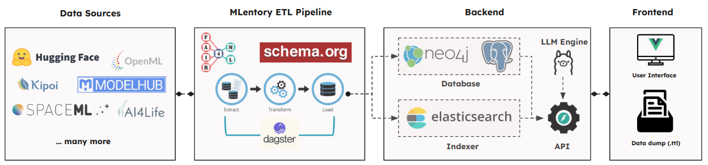

# Architecture Overview

This guide provides a high-level overview of the MLentory ETL Pipeline architecture, covering system components, data flow, design principles, and technology choices.

---

## 🖼️ The Big Picture

The MLentory system is a comprehensive platform for discovering and exploring machine learning models. Here's how all components fit together:



The **ETL Pipeline** (this component) is the data processing engine that:
- Extracts metadata from multiple ML model repositories
- Transforms it into a standardized FAIR4ML format
- Loads it into storage systems (Neo4j graph database, Elasticsearch search index)
- Powers the MLentory frontend, API, and search services

---

## 🧩 Components Breakdown

### Data Sources

The pipeline extracts ML model metadata from multiple external platforms:

- **HuggingFace Hub** - Largest repository of ML models, datasets, and papers
- **OpenML** - Platform for ML experiments, datasets, and model flows
- **AI4Life** - Biomedical AI models and datasets

Each source has its own data format, API structure, and metadata schema.

### Extraction

**Purpose:** Gather raw, unprocessed data from external sources.

**Extraction Methods:**

1. **API-based Extraction** (Primary)

2. **File-based Extraction** (Targeted)

3. **Web Scraping** (Optional, for missing data)

**Input:** External APIs, websites, or configuration files

**Output:** Raw JSON files stored in `/data/raw/<source>/<timestamp>_<uuid>/`

- Model metadata

- Related datasets

- Associated papers

- Base models and dependencies

**What's Saved:**

- Original source format preserved

- Extraction metadata (timestamp, method, source)

- Related entities discovered during extraction

### Transformation

**Purpose:** Convert source-specific formats into standardized FAIR4ML schema.

**What Happens:**

1. Reads raw JSON files from extraction stage

2. Maps each field to FAIR4ML schema structure

3. Validates data completeness and types

4. Enriches data (adds computed fields, resolves references)

5. Builds knowledge graph relationships (identifies connections between models, datasets, papers)

**FAIR4ML Schema:**

- Standardized format ensuring **Findable, Accessible, Interoperable, Reusable** data

- Enables comparison across different sources

- Supports relationship discovery

**Knowledge Graph Construction:**

- Identifies relationships: Model → uses → Dataset, Model → cites → Paper, Model → based_on → Model

- Creates relationship mappings in JSON format

- Prepares data for relationship queries

**Input:** Raw JSON files from `/data/raw/<source>/`

**Output:** Normalized FAIR4ML JSON files in `/data/normalized/<source>/<timestamp>_<uuid>/`

- Models in FAIR4ML format

- Datasets in FAIR4ML format

- Papers, authors, organizations

- Relationship mappings

**What's Saved:**

- Standardized metadata structure (FAIR4ML JSON files)

- Validated and enriched data

- Relationship information for graph construction

### Load

**Purpose:** Persist processed data into storage systems optimized for different use cases.

**What Happens:**

1. **Neo4j Loading** (Graph Database)

   - Creates nodes for models, datasets, papers, authors, organizations

   - Creates relationships (USES_DATASET, CITES_PAPER, BASED_ON, etc.)

   - Enables relationship queries and graph traversals

   - Supports recommendation algorithms based on graph structure

2. **PostgreSQL Loading** (Dagster Metadata)

   - Stores pipeline execution history

   - Tracks asset materialization

   - Maintains data lineage and provenance

   - Powers Dagster UI for monitoring and debugging

3. **Elasticsearch Indexing** (Search Engine)

   - Indexes all metadata for full-text search

   - Creates searchable documents with fields (name, description, tasks, etc.)

   - Enables fast filtering, aggregation, and faceted search

   - Powers the MLentory search interface

**Input:** Normalized FAIR4ML JSON files from `/data/normalized/<source>/`

**Output:**

- **Neo4j:** Graph nodes and relationships queryable via Cypher

- **PostgreSQL:** Pipeline metadata and run 

- **Elasticsearch:** Searchable documents in indices

- **RDF Export:** Semantic web files in `/data/rdf/<source>/` (optional)

**What's Saved:**

- Graph structure in Neo4j (relationships between entities)

- Search indices in Elasticsearch (fast text search)

- Pipeline metadata in PostgreSQL (execution history)

### Fast APIs & Frontend (Nuxt)

**Purpose:** Serve processed data to users through web interface and API.

**What Happens in the Frontend:**

1. **User Search Request**

   - User enters search query in Nuxt frontend

   - Frontend sends request to MLentory Backend API

2. **Backend API Processing**

   - API queries Elasticsearch for full-text search

   - API queries Neo4j for relationship-based queries

   - Combines results and applies ranking

3. **Response to Frontend**

   - API returns search results with metadata

   - Frontend displays models, datasets, papers

   - Shows relationships (e.g., "This model uses these datasets")

4. **Relationship Visualization**

   - Frontend queries Neo4j for graph relationships

   - Displays knowledge graph visualizations

   - Shows connections between models, datasets, papers

5. **Recommendation Service**

   - Backend uses Neo4j graph structure to find similar models

   - Uses Elasticsearch for content-based recommendations

   - Frontend displays recommended models

**Data Flow:**
```
User Query (Nuxt Frontend)
    ↓
Backend API (FastAPI)
    ↓
Elasticsearch (search) + Neo4j (relationships)
    ↓
Results with metadata
    ↓
Nuxt Frontend (displays results, visualizations)
```

**What's Served:**
- Search results (models, datasets, papers)
- Model details and metadata
- Relationship graphs
- Recommendations
- FAIR Digital Object representations

---

## 🔄 Data Flow

Here's an example of how a single model flows through the entire system:

### Example: BERT Model from HuggingFace

**Step 1: Extraction**
```
HuggingFace Hub API
    ↓
HF Extractor (API call)
    ↓
/data/raw/hf/2025-01-15_12-00-00_abc123/
    ├── hf_models.json (BERT metadata)
    ├── hf_datasets.json (SQuAD, GLUE datasets)
    └── arxiv_articles.json (BERT paper)
```

**Step 2: Transformation**
```
/data/raw/hf/.../hf_models.json
    ↓
HF Transformer (FAIR4ML mapping)
    ↓
/data/normalized/hf/2025-01-15_12-00-00_abc123/
    ├── models/mlentory:model:bert.json (FAIR4ML)
    ├── datasets/mlentory:dataset:squad.json
    └── papers/mlentory:paper:1810.04805.json
```

**Step 3: Loading**
```
FAIR4ML JSON files
    ↓
    ├─→ Neo4j: Creates nodes and relationships
    │   (Model)-[:USES_DATASET]->(Dataset)
    │   (Model)-[:CITES_PAPER]->(Paper)
    │
    ├─→ Elasticsearch: Indexes for search
    │   (Searchable by: name, tasks, description)
    │
    └─→ PostgreSQL: Stores pipeline metadata
        (Execution history, lineage)
```

**Step 4: Serving to Frontend**
```
User searches "BERT" in Nuxt frontend
    ↓
Backend API queries Elasticsearch
    ↓
Returns BERT model with metadata
    ↓
Frontend displays model + relationships
    ↓
User clicks "Related Models"
    ↓
Backend queries Neo4j for graph relationships
    ↓
Frontend shows knowledge graph visualization
```

---

## 🎯 Key Design Principles

### 1. Modularity
Each data source (HuggingFace, OpenML, AI4Life) has its own extractor and transformer. Adding a new source doesn't require modifying existing code.

### 2. Idempotency
Running the same extraction twice produces the same result. Assets can be safely re-run without side effects.

### 3. Observability
Dagster provides full visibility into:
- What's running and what's completed
- Success and failure rates
- Data lineage (where data came from)
- Performance metrics

### 4. Fault Tolerance
- Automatic retries on transient failures
- Continues processing even if individual items fail
- Comprehensive error logging for debugging

### 5. Scalability
- Parallel processing (multiple threads per source)
- Can run multiple extractors simultaneously
- Supports horizontal scaling (Kubernetes)

### 6. Data Provenance
- Tracks extraction method (API, scraping, file-based)
- Maintains source references
- Stores transformation history

### 7. Standardization
- All sources transformed to FAIR4ML schema
- Enables cross-source comparison
- Supports interoperability

---

## 🛠️ Technology Stack

### Orchestration: Dagster
**Why:** Built specifically for data pipelines with excellent observability, dependency management, and retry logic. Provides web UI for monitoring and debugging.

### Graph Database: Neo4j
**Why:** Native graph database perfect for relationship-heavy data. Enables complex relationship queries and graph-based recommendations. Cypher query language is intuitive for graph operations.

### Search Engine: Elasticsearch
**Why:** Industry-standard search engine with powerful full-text search, filtering, and aggregation capabilities. Optimized for fast search across millions of documents.

### Metadata Storage: PostgreSQL
**Why:** Reliable relational database for Dagster's metadata storage. Tracks pipeline execution history, asset lineage, and run information. Well-supported by Dagster.

### Schema Validation: Pydantic
**Why:** Type-safe data validation with automatic type checking. Ensures data quality and catches errors early. Integrates well with Python ecosystem.

### Language: Python 3.11+
**Why:** Rich ecosystem for data processing, API clients, and ML libraries. Excellent libraries for web scraping (Selenium), API clients, and data manipulation (Pandas).

### Containers: Docker & Docker Compose
**Why:** Service isolation, easy deployment, and consistent environments. Simplifies local development and production deployment.

### Semantic Web: RDFLib
**Why:** Enables RDF/Turtle export for semantic web compatibility. Supports integration with other FAIR data systems and standards.

### Web Scraping: Selenium
**Why:** Browser automation for extracting data not available via API. Thread-safe browser pool for parallel scraping.

---

## 📚 Related Documentation

- **[Component Details](components.md)** - Deep dive into each component
- **[Data Flow](data-flow.md)** - Detailed data journey through the system
- **[System Design](system-design.md)** - Design decisions and rationale
- **[Deployment](deployment.md)** - Production deployment guide

---

<div class="admonition tip" markdown>
**Let's dive deeper!**
</div>
