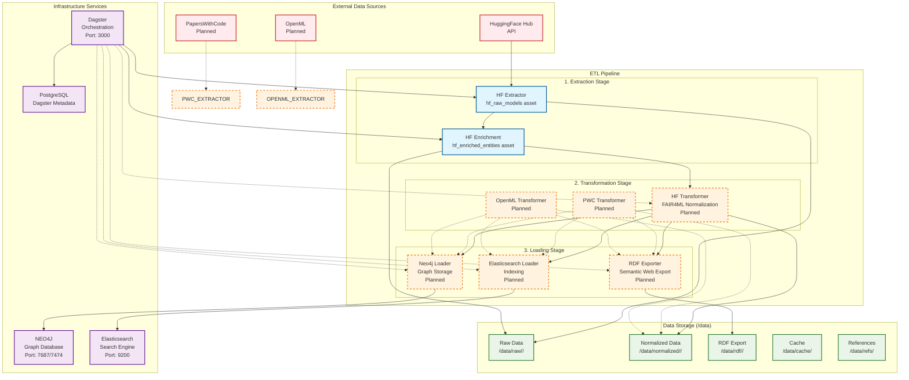

# MLentory ETL Process Diagram



## ETL Pipeline Overview

### Current Implementation ✅
- **HF Raw Models Extraction**: Extracts raw model metadata from HuggingFace Hub API
- **HF Entity Enrichment**: Identifies and extracts related entities (datasets, papers, keywords, licenses)
- **Data Storage**: Raw JSON files stored in `/data/raw/hf/`
- **Dagster Orchestration**: Pipeline managed through Dagster assets

### Planned Implementation 📋
- **FAIR4ML Transformation**: Normalize raw data into FAIR4ML schema
- **Neo4j Loading**: Store normalized data as graph nodes/relationships
- **Elasticsearch Indexing**: Create searchable indices for discovery
- **RDF Export**: Generate semantic web compatible RDF/Turtle files
- **Additional Sources**: PapersWithCode and OpenML extractors

## Data Flow Details

### Stage 1: Extraction
```
HuggingFace API → HF Extractor → /data/raw/hf/models.json
                      ↓
              HF Enrichment → /data/raw/hf/{datasets,articles,keywords,licenses}.json
```

### Stage 2: Transformation (Planned)
```
/data/raw/hf/*.json → FAIR4ML Transformer → /data/normalized/hf/*.json
```

### Stage 3: Loading (Planned)
```
/data/normalized/hf/*.json → Neo4j Loader → Graph Database
                            → ES Loader → Search Indices
                            → RDF Exporter → /data/rdf/hf/*.ttl
```

## Service Dependencies

- **Dagster** orchestrates the entire pipeline
- **PostgreSQL** stores Dagster metadata and run history
- **Neo4j** provides graph storage for ML model relationships
- **Elasticsearch** enables full-text search and discovery

## Key Components

### Extractors
- **HFExtractor**: Downloads model metadata from HuggingFace Hub
- **HFEnrichment**: Extracts related entities and relationships

### Transformers (Planned)
- **FAIR4ML Normalization**: Converts source-specific data to standardized schema
- **Schema Validation**: Ensures data conforms to FAIR4ML Pydantic models

### Loaders (Planned)
- **Neo4jLoader**: Creates graph nodes and relationships
- **ElasticsearchLoader**: Indexes documents for search
- **RDFExporter**: Exports semantic web compatible data

## Configuration

Environment variables control:
- Model extraction limits (`HF_NUM_MODELS`)
- Threading (`HF_THREADS`, `HF_ENRICHMENT_THREADS`)
- Database connections (`NEO4J_URI`, `ELASTICSEARCH_URL`)
- Data directories (`DATA_DIR`)

## Extensibility

The modular design allows easy addition of new data sources:
1. Create source-specific extractor
2. Implement FAIR4ML transformer
3. Add Dagster assets to repository
4. Update docker-compose if needed
